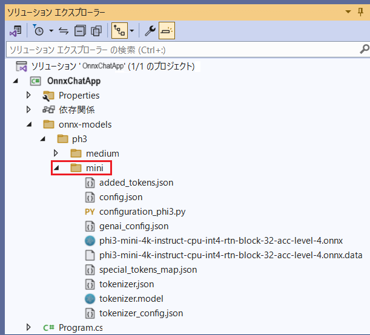
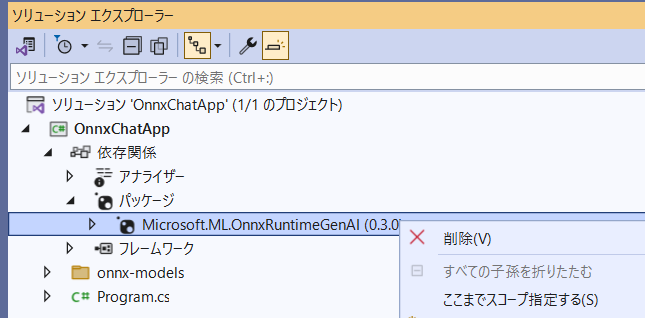
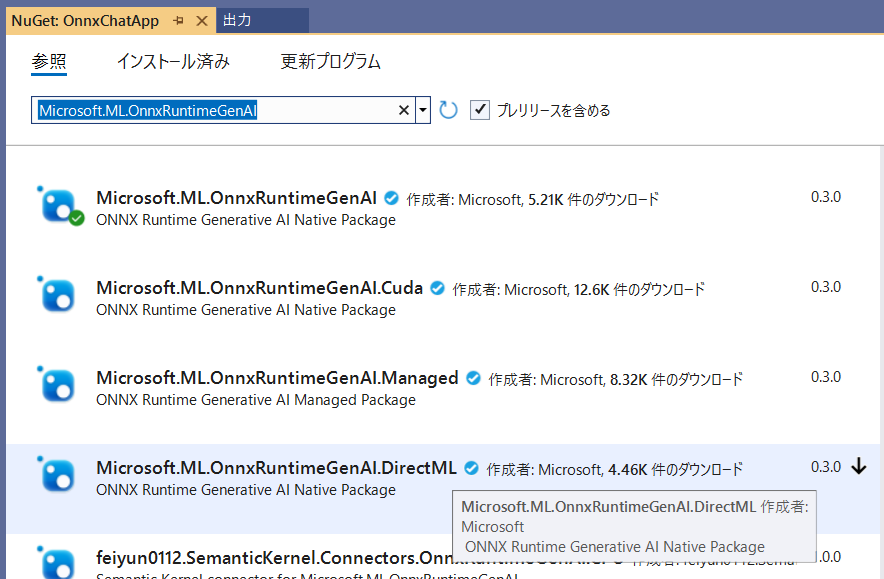

# ONNX 形式の Phi-3 モデルを使用したシンプルなチャットボット アプリケーション (C#)

## 概要
このサンプルは、ONNX 形式の Phi-3 モデルを使用したシンプルなチャットボット アプリケーションのサンプルです。

コンソール アプリケーションとして動作し、ユーザーが入力したテキストを ONNX 形式の Phi-3 モデルに入力し、その結果を表示します。

## 前提条件

このアプリケーションをビルドするには以下の環境が必要です。

- [**Visual Studio 2022**](https://visualstudio.microsoft.com/ja/)

    インストールの際に**コンソール アプリケーション**のビルド環境が含まれていることを確認してください。

- [**huggingface-cli**](https://huggingface.co/docs/huggingface_hub/main/en/guides/cli)

    [huggingface](https://huggingface.co/) から [Phi-3 モデル](https://huggingface.co/collections/microsoft/phi-3-6626e15e9585a200d2d761e3)をダウンロードするのに使用します。手動でダウンロードする方法をご存じの場合は不要です。

    huggingface-cli のインストールには Python が必要です。Python がインストールされていない場合はインストールコマンドを実行する前に、[**Python**](https://www.python.org/downloads/) をインストールしてください。

    ```PowerShell
    pip install -U "huggingface_hub[cli]"
    ```

    以下のコマンドを実行してヘルプを表示し、インストールが成功していることを確認してください。

    ```PowerShell
    huggingface-cli --help
    ```
<br>

## 目次

- [Phi-3 モデルのダウンロード](#phi-3-%E3%83%A2%E3%83%87%E3%83%AB%E3%81%AE%E3%83%80%E3%82%A6%E3%83%B3%E3%83%AD%E3%83%BC%E3%83%89)

- [プロジェクトの準備と実行](#%E3%83%97%E3%83%AD%E3%82%B8%E3%82%A7%E3%82%AF%E3%83%88%E3%81%AE%E6%BA%96%E5%82%99%E3%81%A8%E5%AE%9F%E8%A1%8C)

- [ハードウェア アクセラレーションの使用](#%E3%83%8F%E3%83%BC%E3%83%89%E3%82%A6%E3%82%A7%E3%82%A2-%E3%82%A2%E3%82%AF%E3%82%BB%E3%83%A9%E3%83%AC%E3%83%BC%E3%82%B7%E3%83%A7%E3%83%B3%E3%81%AE%E4%BD%BF%E7%94%A8)

<br>

## Phi-3 モデルのダウンロード

基本的な動作を確認するために、[**Phi-3-mini の ONNX モデル**](https://huggingface.co/microsoft/Phi-3-mini-4k-instruct-onnx)をダウンロードします。

コマンドラインでモデルをダウンロードする作業ディレクトリに移動し、以下のコマンドを実行してモデルをダウンロードします。

```PowerShell
huggingface-cli download microsoft/Phi-3-mini-4k-instruct-onnx --include cpu_and_mobile/cpu-int4-rtn-block-32-acc-level-4/* --local-dir models
```

ダウンロードが完了すると、作業フォルダ下の `models\cpu_and_mobile\cpu-int4-rtn-block-32-acc-level-4` ディレクトリにモデルとモデルを動作させるのに必要なファイル一式が保存されます。

今回はハードウェア アクセラレーションを使用しないモデルをダウンロードしましたが、使用するハードウェア環境に最適化された以下のモデルも用意されています。

- [**DirectML 用**](https://huggingface.co/microsoft/Phi-3-mini-4k-instruct-onnx/tree/main/directml)
- [**CUDA 用**](https://huggingface.co/microsoft/Phi-3-mini-4k-instruct-onnx/tree/main/cuda)

上記、特定のハードウェア環境に最適化されたモデルを使用する場合はアプリケーションの参照設定を変更する必要があります。なお、これについては後述します。

<br>

## プロジェクトの準備と実行

プロジェクトのビルドから実行までの手順は以下のとおりです。

1. ローカルにクローンしたリポジトリにあるファイル `OnnxChatApp.sln` をダブルクリックするか Visual Studio 2022 を起動し、プロジェクトを開きます

2. ソリューション エクスプローラーで `OnnxChatApp` プロジェクトを右クリックし、**NuGet パッケージの復元**を選択します

3. 画面右のソリューション エクスプローラーでフォルダ `onnx-models\ph3\mini` を展開し、ダウンロードした Phi-3 モデルと関連ファイル一式をコピーします

    
    
    なお、ファイルのコピーはエクスプローラー上でファイルを選択し、Visual Studio のソリューション エクスプローラーに直接ドラッグ＆ドロップすることで行えます。

4. ファイル `Program.cs` を開き、変数 `modelPath` に指定しているモデルへのパスを相対パスから絶対パスに変更します

    これはデスクトップ アプリケーションの場合、実行時のカレント ディレクトリがプロジェクトのディレクトリではなく、実行ファイル(*.exe)のディレクトリになるためです。
    
    コンパイル後はプロジェクトルートと一致しますが、デバッグ実行の際は異なるので注意が必要です。

5. Visual Studio のメニューから \[**デバッグ**\] - \[**デバッグの開始**\] を選択してアプリケーションを実行します


6. コマンドライン ウィンドウが表示され、`Prompt:` と表示されたら、'Hello' とタイプして \[Enter\] キーを押下します。

7. モデルから応答が返ったら以下のプロンプトをタイプして \[Enter\] キーを押下します。

    ```
    You are useful assistant. you always reply with Japanese.
    ```

    これで日本語で応答を返すようになるので、日本語で何か入力してみてください。

ここまでの手順で Phi-3 モデルを使用したシンプルなチャットアプリケーションが動作することを確認できました。

アプリケーションを終了するには、コマンドライン ウィンドウを閉じるか、\[Ctrl\] + \[C\] キーを押下します。

さらに高性能なモデルを使用したい場合はサイズの大きい (7GB) [**Phi-3-medium**](https://huggingface.co/microsoft/Phi-3-medium-4k-instruct-onnx-cpu) をお試しください。

<br>

## ハードウェア アクセラレーションの使用

Phi-3 モデルは、ハードウェア アクセラレーションを使用することで高速化が期待できます。

これを使用するには、モデルをダウンロードする際に指定したディレクトリにある、任意のハードウェア アクセラレーションに最適化されたモデルを使用し、かつ、アプリケーション側でも目的のはーどウェア アクセラレーションにあったライブラリを参照する必要があります。

ここからは DirectML 用のモデルを使用する場合を例に説明します。

DirectML (Direct Machine Learning) は、機械学習 (ML) 向けの低水準 API であり、すべての DirectX 12 と互換性のあるハードウェアによってサポートされているため特定のハードウェアベンダーのハードウェアに依存しません。つまり、 DirectX 12 をサポートするグラフィックカードを使用している環境であれば GPU アクセラレーションが可能です。

詳しくは以下のドキュメントをご参照ください。

* [DirectML の概要](https://learn.microsoft.com/ja-jp/windows/ai/directml/dml)


DirectML 用モデルを使用するための具体的な手順は以下のとおりです。

1. 以下のコマンドを実行して [DirectML 用に最適化された Phi-3-mini モデル](https://huggingface.co/microsoft/Phi-3-mini-4k-instruct-onnx/tree/main/directml)をダウンロードします

    ```PowerShell
    huggingface-cli download microsoft/Phi-3-mini-4k-instruct-onnx --include directml/directml-int4-awq-block-128/* --local-dir models
    ```
    ダウンロードが完了すると、作業フォルダ下の `models\directml\directml-int4-awq-block-128` ディレクトリにモデルとモデルを動作させるのに必要なファイル一式が保存されます。

2. プロジェクトのフォルダ `onnx-models\ph3\mini` の内容をダウンロードした DirectML 用の Phi-3 モデルと関連ファイル一式に置き換えます

3. 画面右の \[ソリューション エクスプローラー\] で \[依存関係\] のツリーを展開し、パッケージ `Microsoft.ML.OnnxRuntimeGenAI` を右クリックして削除します

    

4. Visual Studio のメニューから \[**プロジェクト**\] - \[**NuGet パッケージの管理**\] を選択します。

5. \[**参照**\] タブをアクティブにし、検索ボックスに `Microsoft.ML.OnnxRuntimeGenAI` と入力して、**Microsoft.ML.OnnxRuntimeGenAI.DirectML** を選択してインストールします

    

    ちなみに CUDA 用のモデルを使用する場合は、同様に `Microsoft.ML.OnnxRuntimeGenAI.CUDA` を選択してインストールします。

5. Visual Studio のメニューから \[**デバッグ**\] - \[**デバッグの開始**\] を選択してアプリケーションを実行します

ここまでの手順で DirectML 用の Phi-3 モデルを使用したシンプルなチャットアプリケーションが動作することを確認できました。

